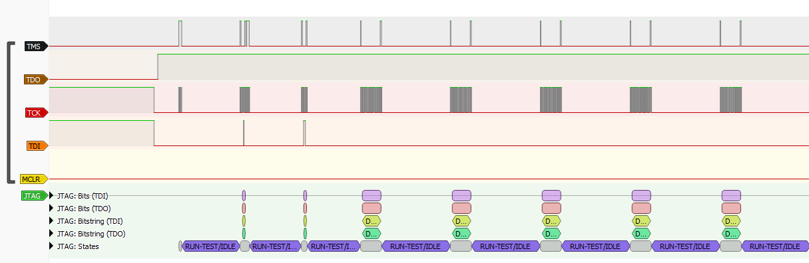
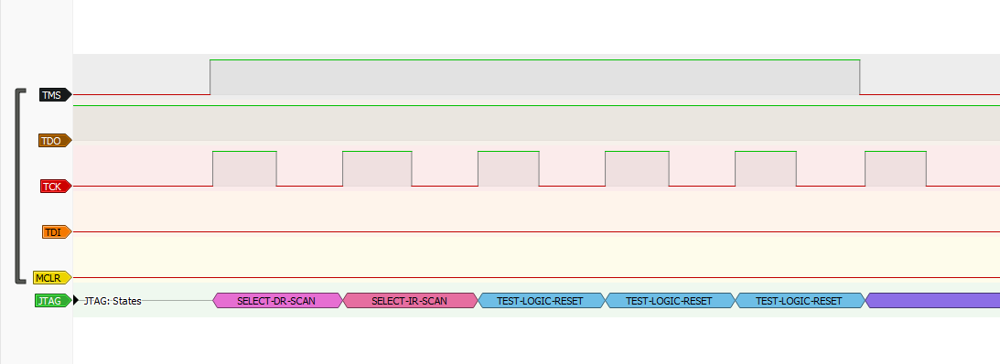
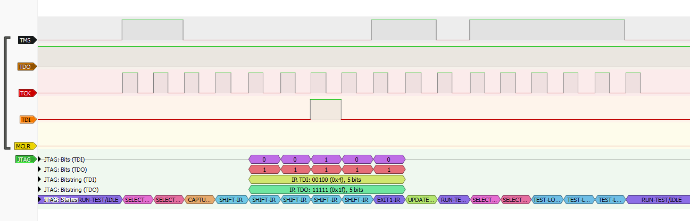
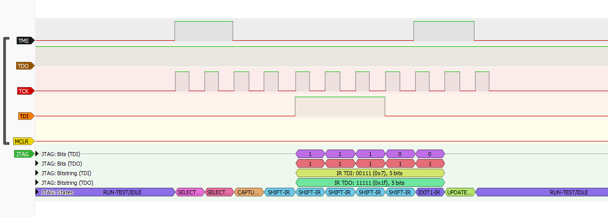
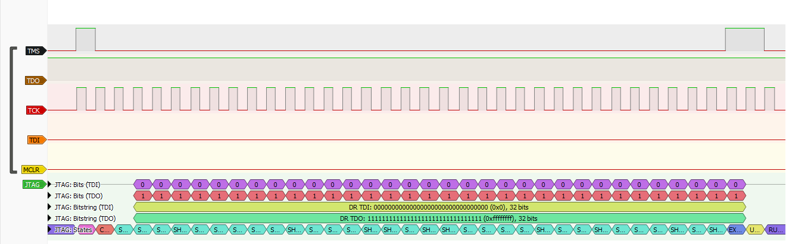

# CS140E Final Project: PIC32 JTAG and ICSP Programmers on the Raspberry Pi A+
## khuang and choiben214

### Github Repo:
https://github.com/choiben314/pic-programmer

## What Is It?

We created an external programming tool to load programs on to the PIC32 using the Raspberry Pi A+. Currently, we are still in the process of adding support for loading programs, but the programmer successfully checks for device status, erases the device, and enters the serial execution mode needed to load programs.

## Why?

We worked with the PIC32 in a mechatronics course (ME218B) using an external programming tool (SNAP) and wanted to learn the inner-workings of the programming tool and how it actually loads programs on to the PIC. We also wanted to explore JTAG and ICSP programming.

## How to run this code?
This code was developed and tested on  a Raspberry Pi A+. 
Connect pins as follows for 4-wire JTAG:

- MCLR: gpio26 on Pi to pin 1 on PIC
- TDI: gpio5 on Pi to pin 16 on PIC
- TCK: gpio6 on Pi to pin 17 on PIC
- TDO: gpio13 on Pi pin 18 on PIC
- TMS: gpio19 on Pi to pin 22 on PIC

Connect pins as follows for 2-wire ICSP:
- MCLR: gpio26 on Pi to pin 1 on PIC
- PGD: gpio5 on Pi to pin 16 on PIC
- PGC: gpio6 on Pi to pin 17 on PIC

## Process and Challenges
Upon reviewing the PIC32 Flash Programming Specification, we realized there are 3 main ways we could write an external programmer for the PIC32: 4-wire Enhanced JTAG (EJTAG), 2-wire ICSP with two-phase multiplexing, and 2-wire ICSP with four-phase multiplexing.

*Figure 1. High-Level Flash Programming Block Diagram*

### What We Tried
**4-wire JTAG attempt**

We first decided to use the 4-wire JTAG implementation because we had enough pins on both the Pi and PIC to use more wires, we wanted to learn about the more general JTAG industry standard, and we could avoid the time multiplexing that needed to be done for the 2-wire ICSP implementations.

However, with the 4-wire JTAG attempts, we had trouble correctly reading the device status. We implemented the pseudoinstructions `set_mode`, `send_command`, and `xfer_data` by manually setting the JTAG gpio outputs MCLR, TDI, TCK, TDO, and TMS according to the figures below.

*Figure 2. SetMode 4-Wire Timing Diagram*

*Figure 3. SendCommand 4-Wire Timing Diagram*

*Figure 4. XferData 4-Wire Timing Diagram*

After implementing these initial pseudoinstructions we were able to implement reading the device status of the PIC using the previously implemented pseudoinstructions as shown in *Figure 5*.

*Figure 5. Check Device Status Block Diagram*

Upon implementing this, we saw that device status was never correctly set with the correct values for `FCBUSY` and `CFGRDY` bits. 

To debug this, we tried a number of steps incuding verifying hardware, software debugging, and checking signals with a logic analyzer. The first issue we found was that we needed to ensure both pullup and pulldown pins were disabled for the input pin TDO. 

Next, with the logic analyzer we verified that `statusVal` variable in software was correctly getting the values of the input TDO pin from hardware. We verified these values matched with a logic analyzer; however, the values were just never getting correctly set to indicate the device status was ready. 

*Figure 6* below shows the overall check device status waveform on the logic analyzer and *Figures 7-10* show the specific waveforms for each pseudoinstruction step in checking device status that we verified has the same values in software. *Figure 10* shows the `XferData` command in which TDO was not getting the correct values for bits `FCBUSY` and `CFGRDY`. 

*Figure 6. Overall 4-wire Logic Analyzer Waveform*

*Figure 7. SetMode Instruction Logic Analyzer Waveform*

*Figure 8. SendCommand(MTAP_SW_MTAP) Logic Analyzer Waveform*

*Figure 9. SendCommand(MTAP_COMMAND) Logic Analyzer Waveform*

*Figure 10. XferData(MCHP_STATUS) Logic Analyzer Waveform*

Next, we attempted to compare our `statusVal` to that of a working implementation of a PIC32 programmer. Unfortunately, we did not have a JTAG programmer to verify with and only the 2-wire ICSP SNAP programmer. We connected the SNAP programmer and loaded a random program. We manually reviewed the programming sequence at the beginning of loading the program using the logic analyzer again. However, because the SNAP uses a 2-wire ICSP SNAP programmer we had to manually demultiplex the values of PGD. Because there are two possible multiplexing options for the 2-wire ICSP implementation, we had to determine whether it was using 2-phase or 4-phase multiplexing by comparing the very first set_mode command we saw to what we expected from the Flash Programming Specification datasheet. We, then determined that PGD was using a 4-phase demultiplexing scheme where TDI and TMS are written on the falling edge of the first two clock cycles and TDO is read on the rising edge of the fourth clock cycle in the 4-phases (pictured in *Figure 11*).

*Figure 11. 4-Phase Multiplexing Diagram*

We continued to follow the waveform generated by the SNAP when checking device status, which successfully matched our expectations until the `XferData` step. During this step, we noticed `XferData` was not transmitting TMS header, 32 bits, then TMS footer as we expected. Instead, it transmitted TMS header, 13 bits, then the TMS footer. We determined that this was likely a result of optimizations done by SNAP to speed up programming; however, this meant that we could no longer correctly verify our `statusVal` value against the proper demultiplexed TDO value from a working implementation. 

Therefore, we decided to verify against the closest thing to a working 4-wire JTAG implementation we could find. We found [tekaikko's ArduPIC32 repo](https://github.com/tekaikko/ardupic32) which implemented a 4-wire JTAG programmer for the PIC32 on the Arduino instead of the Pi. We cloned this repository and tried testing on an Arduino Mini, which compiled right out-of-the-box. Interestingly, this implementation also did not work for us and hung in the same place our 4-wire JTAG implementation was hanging - getting the correct device status. Therefore, we concluded that we may have needed an additional hardware [JTAG adapter](https://ww1.microchip.com/downloads/en/DeviceDoc/50002530A.pdf) or something else to enable JTAG programming on the PIC32 as the IDE we use to program it is only setup by default to use 2-wire ICSP programming through the SNAP. 

**Switch to 2-wire 4-phase ICSP**

Thus, we decided to switch gears and try implementing a 2-wire 4-phase programmer similar to the SNAP that we could compare against. To do so, we had to modify our pseudoinstructions and helper functions to multiplex values of TDI, TMS, and TDO according to the figures below.

*Figure 12. SetMode 2-Wire Timing Diagram*

*Figure 13. SendCommand 2-Wire Timing Diagram*

*Figure 14. XferData 2-Wire Timing Diagram*

This two-wire implementation ended up working and correctly getting device status, erasing the device, and setting the device in serial execution mode.

### Looking Forward
**Loading Program Executive**

The program executive (PE) is code downloaded onto RAM that receives and loads the program into device flash memory.

According to Section 11.0 in PIC32MX Flash Programming Specification, loading the PE onto RAM consists of two steps:

1. Loading the PE Loader onto RAM. This loads the PE binary into the correct location on RAM and then jumps to it.
2. Actually providing the PE Loader with the PE binary once the loader is in place.

The PE hex file can be found on the Microchip website. Detailed instructions for loading the PE into device RAM can be found in Section 11.0 of PIC32MX Flash Programming Specification.

**Downloading a Data Block**

Once the PE is loaded into RAM, the actual program must be downloaded onto the device. Once the PE is loaded, block-wise programming occurs trivially via the following commands.

`XferFastData(PROGRAM|DATA_SIZE)` \
`XferFastData(ADDRESS)` \
`XferFastData(32'h0x0)`

The PE then immediately writes the program to flash memory from RAM automatically.

**Verify Device Memory**

The program can then be verified once it has been downloaded to ensure that all data was programmed correctly. This is completed through calculation of checksums, as shown below.

`XferFastData(GET_CRC)` \
`XferFastData(START_ADDRESS)` \
`XferFastData(LENGTH)` \
`valCkSum = XferFastData(32'h0x0)`

MCLR may then be asserted to exit programming mode and begin program execution.

## Useful Resources
- [PIC32MX Flash Programing Specification](http://ww1.microchip.com/downloads/en/devicedoc/61145g.pdf)
    - most useful resource by far
    - contains useful instructions, block diagrams, and timing diagrams describing how to put PIC32 into programming mode and load programming executive and actual program code
- [Arduino ICSP Programmer Repo for PIC16](https://github.com/jaromir-sukuba/a-p-prog)
    - similar project to ours but there are many differences between PIC16 family and PIC32 family
- [PIC32MX Section 5: Flash Programming Documentation](https://ww1.microchip.com/downloads/en/DeviceDoc/60001121g.pdf)
    - more general overview of flash programming than first link
- [PIC32 Programming and Diagnostics](https://ww1.microchip.com/downloads/en/DeviceDoc/61129F.pdf
)
- [PIC32 Family Datasheet](https://ww1.microchip.com/downloads/aemDocuments/documents/MCU32/ProductDocuments/DataSheets/PIC32MX1XX2XX283644-PIN_Datasheet_DS60001168L.pdf
)
    - useful for PIC32 pinouts 
- [ICSP Guide](https://ww1.microchip.com/downloads/en/DeviceDoc/30277d.pdf
)
- [General Overview of ICSP](https://en.wikipedia.org/wiki/In-system_programming
)
- [Technical Guide to JTAG](https://www.xjtag.com/about-jtag/jtag-a-technical-overview/)
- [ArduPIC32 Repo - Arduino JTAG programmer for PIC32](https://github.com/tekaikko/ardupic32)

